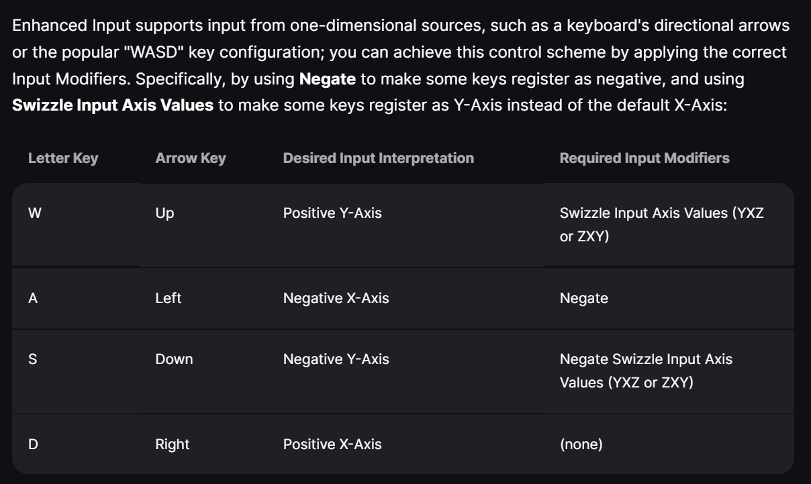

basic game
- added "World Settings" to editor UI
- level: like unity scene
- game mode (bp): like game director, but specifically not an actor or controller (unity doesn't have one, we just use monobehaviours)
- pawn (bp): [not a player controller?] an actor (including mesh) that player can represents player or is controlled by player
- set: 
	- game mode/default pawn->BP_playerpawn
	- world settings/game mode->GM_mine
- [why is camera angle and pawn location weird every time !! place "player start" in world]
- i looked at the C++ for the top-down sample (tutorial0).

input
- tute uses Engine/input, we should use Enhanced Input
	- [axis mappings "scale" -1 and +1 does not exist !! you need to apply modifier "Negate" on one instance of the action]
	- created IA for move (axis, confused) and shoot

- BP_pawn has an "event graph" (the actual blueprint)
- input mappings make more sense on a playercontroller, but can be put on any BP if you add mapping context
	- [Get PlayerController for player0 -> create Enhanced Input Local Player Subsystem Node -> Add Mapping Context where target is input subsystem interface]

firing a bullet
- Add a "scene component" to any BP to create an "empty transform"
- [initial bullet spawn location caused my plane to behave weird and jump around ? trying to spawn bullets within the convex bounds of my plane mesh might have tried to displace the ship to accommodate the bullet]

viewport wrapping
- GameMode BP can return viewport dimensions [X,Y] (pixels)
- add tag (eg: `wrap`) to mesh components that need to wrap
- create a BP component (not an actor)
	- get owner (parent with this component) 
	  -> get components by tag -> loop array -> get world location
	  -> check [X,Y] within viewport bounds -> [-1/1,-1/1]x[X,Y] where out/in bounds in that axis -> set world location to warp
	- just -1x means will be out of bounds the other way and immediately re-warp. using -.99x fixes
	- [ viewport dims =/= world position at edges ? viewport in px, but world position in game units. is there a way to get the scale factor between them? what does it depend on? ]
- attach BP component to BPs with `wrap` meshes
- [ who determines player camera ? any active camera, if only one ]
- [ how to get mesh size in world units ? something with mesh bounds + some matrix math ]

ship collision & damage
- add a new mesh component + dimensions -> set visible false -> disable physics sim -> add component begin overlap event -> cast other actor -> trigger hp tickdown
- you can just have meshes lying around with no physics/colliders to use as a hacky UI

sfx
- unreal has a powerful audio management system
- bfxr is a pretty good arcade sfx tool
- just throwing some sounds in takes the gamefeel from 10% -> 50% of the way there, but a lot more work to get from 50% -> 80+!
	- i tried randomizing sounds for the laser, but it doesn't sound great. would be better to have some kind of semi-random but curated pattern, with sounds closer to each other
	- programmatically, a single sound with (controlled) randomized audio transforms applied could work too.

general
- bp print can use a "Key" to overwrite existing entry (neat!)
- tick -> "Is Valid" -> branch/true -> [logic] prevents destroyed object manipulation errors from [logic]
- go to Edit -> Project Settings -> Maps & Modes -> Default Maps
- [aligning unreal XY between screen/world is confusing ! unreal uses left-hand-rule, unity uses right-hand-rule]
